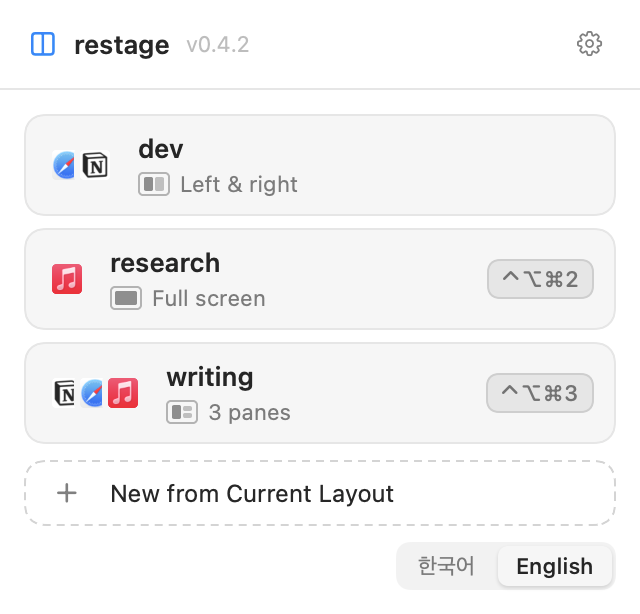

<div align="center">

# restage

**미리 선언한 앱과 창 배치를 한 번에 되돌리는 macOS 도구.**

[](https://github.com/chakki-the-potato/restage/actions/workflows/ci.yml)
[](https://github.com/chakki-the-potato/restage/releases/latest)
[](https://www.apple.com/macos/)
[](LICENSE)

[English](README.md) · 한국어

<picture>
  <source media="(prefers-color-scheme: dark)" srcset="docs/images/panel-dark.png">
  
</picture>

</div>

---

일을 시작할 때마다 같은 앱을 열고 같은 창을 같은 구석으로 끌어다 놓는다. 그것을 한 번만
적어 두면 된다.

```yaml
workspace: dev
hotkey: "ctrl+alt+cmd+1"
screens:
  - id: main
    items:
      - {type: app, app: cursor, slot: left-half}
      - {type: app, app: iterm,  slot: right-half}
```

```console
$ restage open dev
```

앱이 뜨고, 창이 적어 둔 자리에 놓이고, 브라우저 탭이 열린다. 단축키를 눌러도 되고 메뉴바에서
클릭해도 된다.

## 세 가지 약속

**좌표를 저장하지 않는다.** 자리는 `left-half` 같은 이름이고, 실행하는 시점의 화면으로
계산한다. 모니터가 바뀌어도 파일은 그대로 쓴다.

**이미 맞으면 건드리지 않는다.** 두 번 실행해도 두 번째에는 아무것도 움직이지 않는다.

**선언하지 않은 것은 손대지 않는다.** 파일에 없는 앱은 숨기지도 종료하지도 않는다. 이미 열린
탭은 닫지 않고 없는 것만 추가한다.

## 설치

```bash
brew install chakki-the-potato/tap/restage
open $(brew --prefix restage)/restage.app
```

<details>
<summary>Homebrew가 없다면</summary>

```bash
curl -fsSL https://raw.githubusercontent.com/chakki-the-potato/restage/main/install.sh | bash
```

</details>

둘 다 소스를 받아 이 컴퓨터에서 빌드한다. 직접 빌드한 앱은 Gatekeeper가 막지 않으므로
"확인되지 않은 개발자" 경고도, 우클릭으로 여는 번거로움도 없다. macOS 13 이상과 Xcode
명령줄 도구가 필요하고, 없으면 설치 스크립트가 안내한다.

> [!IMPORTANT]
> 창을 옮기려면 **접근성** 권한이 필요하다. 앱을 처음 열면 안내가 뜬다. 직접 켜려면 시스템
> 설정 → 개인정보 보호 및 보안 → 손쉬운 사용에서 **restage**를 켠다.
>
> 터미널에서 쓸 때 승인 대상은 *명령을 실행한 터미널 앱*이다. iTerm에서 실행한다면 iTerm을
> 켜고, 켠 뒤 터미널을 완전히 종료했다 다시 연다.

## 첫 워크스페이스

창을 원하는 대로 배치해 두고 명령 하나면 된다.

```console
$ restage new dev
```

지금 열린 창을 읽어 이렇게 보여준다.

```
현재 창 배치를 읽었습니다.

  main
    1. Safari · 문서       왼쪽 절반   탭 2개
    2. Safari · 메일       오른쪽 절반
  external-1
    3. iTerm               좌하?       [다른 데스크탑]

  ? 는 자리가 애매하다는 뜻입니다. 번호를 눌러 직접 고르세요.
[Enter] 저장   [숫자] 자리 바꾸기   [-숫자] 제외   [+] 앱 추가   [w] 웹 추가   [q] 취소
```

Enter를 누르면 `~/.config/restage/dev.yaml`이 만들어진다. 메뉴바의 **현재 창 배치로 새로
만들기**도 같은 일을 체크박스와 드롭다운으로 한다.

- 브라우저는 **열려 있는 탭까지 함께 담는다.** 시작 페이지나 새 탭은 담지 않는다
- 자리가 애매하면 `?`가 붙는다. **조용히 추측하지 않는다**
- 제목으로 구분할 수 없는 창은 담지 않고, 그 사실을 알린다
- 안 켜둔 앱은 `+`로, 지금 안 열려 있는 URL은 `w`로 추가한다

## 메뉴바

카드를 누르면 실행된다. 카드는 그 안에 무엇이 들었는지 보여준다. 실제 앱 아이콘을 세 개까지
겹쳐 놓고 넘으면 `+2`로 세며, 이름 아래에 배치 모양을 그린다.

| | |
|---|---|
| **마우스를 올리면** | 단축키 칩이 사라지고 편집과 더보기가 들어온다 |
| **단축키** | 원하는 조합을 그냥 누른다. config의 `hotkey` 줄만 바뀐다 |
| **실행 중** | 어느 앱을 몇 개째 여는 중인지 카드에 보인다 |
| **실패하면** | 사유와 다시 시도가 카드 안에 붙는다 |
| **없는 앱** | 점선 표시와 함께 사유가 붙는다 |

톱니에는 로그인 시 자동 실행, 화면 모드, 업데이트 확인, config 폴더 열기, 종료가 있다.

### 언어와 화면 모드

둘 다 기본은 시스템을 따른다. 목록 아래에 **한국어 · English**가 있고, 톱니의 **화면 모드**는
시스템 설정 · 라이트 · 다크 중 고른다. 어느 쪽이든 바로 바뀐다. 패널을 띄워 둔 채 바꿔도
그 자리에서 바뀐다.

### 업데이트

**업데이트 확인**을 누를 때만 GitHub에 물어본다. 주기적으로 확인하지 않는다. 이 도구를 쓰는 데
네트워크가 필요 없어야 하기 때문이다. 새 버전이 있으면 받는 방법을 알려준다. Homebrew로
설치했으면 그 명령을, 아니면 릴리스 페이지를 안내한다.

## 자세히

<details>
<summary><b>config 형식</b></summary>

config는 `~/.config/restage/<이름>.yaml`에 둔다. `examples/`에 단일 화면, 브라우저 탭,
듀얼 모니터 예시가 있다.

```yaml
workspace: dev            # 필수. 워크스페이스 이름
hotkey: "ctrl+alt+cmd+1"  # 선택. 메뉴바 실행 중에만 동작

screens:
  - id: main              # 필수. 보고서에 표시된다
    display: builtin      # builtin | external-N | any. 기본값 any
    mode: desktop         # desktop | fullscreen. 기본값 desktop
    anchor: cursor        # 선택. 이 화면 처리 후 포커스할 앱
    items:
      - {type: app, app: cursor, slot: left-half}
      - {type: app, app: iterm,  slot: right-half}

  - id: web
    display: external-1
    items:
      - type: browser
        app: safari
        window: separate  # separate | shared. 기본값 separate
        slot: full        # 선택. 없으면 창 크기를 건드리지 않는다
        tabs:
          - https://example.com
          - https://example.org
```

**slot** — `full`, `left-half`, `right-half`, `top-half`, `bottom-half`,
`q1`~`q4`, `centered`. 사분면은 읽는 순서다. `q1` 좌상, `q2` 우상, `q3` 좌하, `q4` 우하.
`type: app`에서 생략하면 `full`이고, `type: browser`에서 생략하면 창 크기를 건드리지 않는다.

**display** — `builtin`은 주 디스플레이. `external-N`은 외장 디스플레이를 프레임 원점 기준으로
정렬한 뒤 N번째(1부터). `any`는 현재 `builtin`과 동작이 같다. 연결되지 않은 디스플레이를
지정하면 그 화면만 건너뛰고 사유를 보고한다.

**전체 화면** — 자리 대신 고르면 그 앱만 전용 데스크탑으로 보낸다. 창 메뉴의 "전체 화면"과
같다.

```yaml
- {type: app, app: Cursor, slot: full, fullscreen: true}
```

**창이 여러 개인 앱** — `title`로 어느 창을 옮길지 지정한다. 제목의 일부면 된다. 없으면 가장
최근 활성 창을 고른다.

```yaml
items:
  - {type: app, app: safari, slot: left-half,  title: 시작 페이지}
  - {type: app, app: safari, slot: right-half, title: 작업}
```

**앱 이름** — 설치된 앱이면 무엇이든 되고, Finder에 보이는 이름을 그대로 적는다. 대소문자를
가리지 않고 짧은 이름도 알아듣는다. `chrome`은 Google Chrome을, `edge`는 Microsoft Edge를
가리킨다. 정확히 일치하는 이름이 있으면 항상 그쪽이 이긴다. 이름이 여럿에 걸리면 후보를
알려주고 멈추며, 없는 이름이면 비슷한 것을 제안한다.

</details>

<details>
<summary><b>명령과 결과</b></summary>

```bash
restage new dev               # 현재 창 배치로 새로 만들기
restage open dev              # 이름으로
restage open ./my.yaml        # 경로로
restage list                  # 등록된 워크스페이스
restage menubar               # 메뉴바 실행
restage --version             # 버전
restage --help                # 사용법
```

`restage open`은 결과를 표로 출력한다.

```
SCREEN   APP      RESULT            EXPECTED         ACTUAL           NOTE
main     safari   placed            0,33 864x1027    0,33 864x1027
main     notion   alreadySatisfied  864,33 864x1027  -                이미 목표 상태
```

| 결과 | 의미 |
|---|---|
| `placed` | 배치했다 |
| `alreadySatisfied` | 이미 목표 상태여서 건드리지 않았다 |
| `constrained` | 앱이 막았다. 최소 크기, 크기 고정, 전체화면 미지원 |
| `unreachable` | 창이 다른 Space에 있어 접근할 수 없다 |
| `failed` | 그 외 실패 |
| `skipped` | 건너뛴 화면이나 미지원 기능 |

한 항목이 실패해도 나머지는 계속 진행하고, 마지막에 실패 목록을 사유와 함께 보고한다.

</details>

<details>
<summary><b>알려진 한계</b></summary>

macOS가 허용하지 않아 생기는 제약이 대부분이다.

**특정 데스크탑(Space)에 배치할 수 없다.** 공개 API가 없다. 대신 `mode: fullscreen`을 쓰면
macOS가 전용 Space를 만들어 준다.

**전체화면 해제는 창에 닿을 수 있을 때만 된다.** 접근성으로 전체화면 속성을 끌 수 있고
restage는 배치 전에 그렇게 한다. 다만 전체화면 앱의 창은 전용 Space에 있어서, 다른 곳에서는
접근성이 그 창을 아예 보지 못한다. 끌 대상이 없는 것이다. restage가 그 Space까지 따라가
보고, 그래도 안 되면 `ctrl+cmd+F`로 직접 해제해야 한다.

**다른 데스크탑의 창을 다루려면 설정이 하나 필요하다.** 그냥 두면 `unreachable`로 보고된다.
창을 다른 데스크탑으로 옮기는 것은 공개 API로도 비공개 API로도 되지 않는다. 창 서버의 비공개
함수를 직접 불러 확인했고, 다른 앱의 창에는 조용히 무시된다. yabai 같은 도구가 SIP 부분 해제를
요구하는 이유다. 측정 기록은
[space-placement-results](docs/superpowers/plans/2026-08-25-space-placement-results.md)에 있다.

대신 그 데스크탑으로 넘어가는 방법을 쓴다. 시스템 설정 → 데스크탑 및 Dock →
*"응용 프로그램으로 전환할 때, 해당 앱의 열린 윈도우가 있는 공간으로 전환"*을 켠다. 켜면
restage가 앱을 활성화해 그 데스크탑으로 넘어간 뒤 창을 배치한다. 측정값이다.

```
활성화 전 AX 창 0개  →  AXFrontmost 설정  →  활성화 후 2개
```

대신 평소에 앱을 전환할 때도 화면이 데스크탑을 넘나든다. 취향이 갈리는 설정이다. 되돌리려면
다음을 실행한다.

```bash
defaults delete com.apple.dock workspaces-auto-swoosh && killall Dock
```

**일부 앱은 최소 크기를 강제한다.** Xcode는 너비 940, KakaoTalk은 높이 640 아래로 줄지 않는다.
`constrained`로 보고된다.

**브라우저 탭 순서는 첫 실행에만 정확하다.** 이후 추가되는 탭은 창 끝에 붙는다. 순서를
보장하려면 기존 탭을 닫아야 하는데 사용자 작업을 지우게 되므로 그렇게 하지 않는다.

**Firefox 계열은 탭을 다룰 수 없다.** 탭 제어 어휘를 외부에 열어두지 않는다. 창 배치는 되지만
`tabs`는 실패로 보고한다. Safari와 Chromium 계열(Chrome, Edge, Brave, Arc, Whale, Vivaldi)은
같은 경로로 동작한다. **Safari, Chrome, Brave 세 가지로 검증했고** 나머지는 같은 코드를 타지만
확인하지 않았다. 탭 제어에는 Apple Events 권한이 대상 앱별로 최초 1회 필요하다.

**화면이 잠겨 있으면 동작하지 않는다.** 잠긴 상태에서는 접근성 API가 창을 조회하지 못한다.
restage가 이를 감지해 사유를 밝히고 멈춘다.

</details>

<details>
<summary><b>개발</b></summary>

```bash
swift build
swift test        # 211개
```

실행 중인 앱을 대상으로 배치 성공률을 측정한다.

```bash
restage probe --slot left-half
```

기본값은 아무 앱도 종료하지 않는다. 콜드 스타트까지 보려면 `--cold`를 준다. 대상 앱을 **강제
종료하므로** `--app`으로 하나만 지정해야 하고, 실행 전에 확인을 받는다.

화면도 화면 기록 권한도 없이 패널을 PNG로 그려 볼 수 있다.

```bash
RESTAGE_SNAPSHOT_DIR=/tmp/shots swift test --filter renderPanel
```

```
Sources/RestageKit/         OS에 의존하지 않는 스키마·검증·좌표 계산과 번역 문구
Sources/RestageKitDarwin/   AX·AppKit·AppleScript 구현
Sources/restage/            CLI와 메뉴바
Sources/RestageBrand/       앱 아이콘과 메뉴바 아이콘의 도형 정의
Sources/restage-icon/       .iconset을 굽는 빌드 도구
docs/superpowers/           설계 스펙과 검증 기록
```

`docs/`는 왜 그렇게 만들었는지와 macOS가 실제로 어떻게 동작하는지를 적어둔 것이다. 사용
설명서가 아니라, 같은 문제를 겪는 사람에게 참고가 될 수 있는 기록이다.

</details>

## 라이선스

MIT. [LICENSE](LICENSE) 참조.
