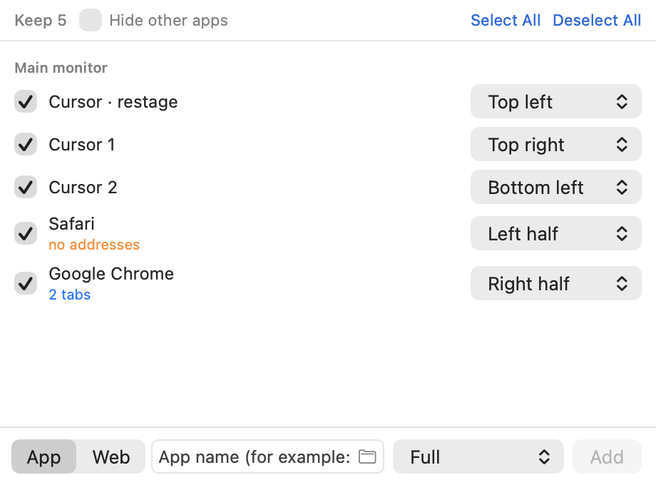

<div align="center">

# restage

**Restore a declared layout of apps and windows on macOS — in one step.**

[](https://github.com/chakki-the-potato/restage/actions/workflows/ci.yml)
[](https://github.com/chakki-the-potato/restage/releases/latest)
[](https://www.apple.com/macos/)
[](LICENSE)

English · [한국어](README.ko.md)

<picture>
  <source media="(prefers-color-scheme: dark)" srcset="docs/images/panel-dark.png">
  
</picture>

</div>

---

Every time you sit down to work you open the same apps and drag the same windows
into the same corners. Write it down once instead.

```yaml
workspace: dev
hotkey: "ctrl+alt+cmd+1"
screens:
  - id: main
    items:
      - {type: app, app: cursor, slot: left-half}
      - {type: app, app: iterm,  slot: right-half}
```

```console
$ restage open dev
```

Apps launch, windows land where you said, browser tabs open. Or press the
shortcut. Or click it in the menu bar.

## Three promises

**It doesn't store coordinates.** Positions are names like `left-half`, resolved
against whatever screen you have at the time. Change monitors and the file still
holds.

**It leaves things alone when they're already right.** Run it twice and nothing
moves the second time.

**It doesn't touch what you didn't declare.** Apps missing from the file are
neither hidden nor quit. Tabs you already have open stay open — only missing
ones are added. The one exception is `hideOthers`, which you have to turn on
yourself.

## Install

```bash
brew install chakki-the-potato/tap/restage
open $(brew --prefix restage)/restage.app
```

<details>
<summary>Without Homebrew</summary>

```bash
curl -fsSL https://raw.githubusercontent.com/chakki-the-potato/restage/main/install.sh | bash
```

</details>

Both fetch the source and build it on your machine, so Gatekeeper never gets in
the way — no "unidentified developer" warning, no right-click-to-open dance.
macOS 13 or later and the Xcode command line tools are required; the installer
walks you through the latter.

> [!IMPORTANT]
> Moving windows needs **Accessibility** permission. The app asks the first time
> you open it — or turn **restage** on yourself in System Settings → Privacy &
> Security → Accessibility.
>
> From the terminal, the thing you approve is *the terminal app that ran the
> command*. Approve iTerm if you run it from iTerm, then quit and reopen it.

## Your first workspace

Arrange your windows the way you like them, then:

```console
$ restage new dev
```

It reads what you have open and shows it back to you:

```
Read the current window layout.

  main
    1. Safari · Docs        Left half    2 tabs
    2. Safari · Mail        Right half
  external-1
    3. iTerm                Bottom left? [another desktop]

  ? means the position is ambiguous. Press its number to choose one yourself.
[Enter] save   [number] change position   [-number] remove   [+] add an app   [w] add a browser   [q] cancel
```

Press Enter and `~/.config/restage/dev.yaml` is written. The menu bar's **New
from Current Layout** does the same thing with checkboxes and dropdowns. There,
clicking a window's name brings it to the front so you can tell which is which,
and **Web** adds a browser with the addresses you paste.

- Browsers are saved **with the tabs they have open** — start pages and new tabs
  are skipped
- An ambiguous position gets a `?`. It **doesn't guess quietly**
- Several windows of one app are all saved. Those with a distinct title are
  matched by title; the rest take their positions in order and show as
  `Cursor 1`, `Cursor 2`
- A browser sitting on its start page is saved with no addresses. Click the
  address count in the editor to add some
- Add an app that isn't running with `+`, a URL that isn't open with `w`



## The menu bar

Click a card to run it. A card shows what's inside: up to three real app icons,
counted as `+2` beyond that, and the shape of the arrangement drawn under the
name.

| | |
|---|---|
| **Hover** | the shortcut chip gives way to Edit and More |
| **Shortcut** | press the combination you want; only the `hotkey` line changes |
| **While running** | the card says which app it's opening and how far along |
| **On failure** | the reason and a Retry, right in the card |
| **Missing app** | drawn as a dashed placeholder with the reason underneath |

The gear holds Open at Login, Appearance, Cycle Shortcut, Check for Updates,
Open Config Folder, and Quit.

**Cycle Shortcut** moves to the next workspace on one key, in the order the list
shows. Which one you opened last is remembered by the app, not written to any
config file, and the card you are on carries a dot.

### Language and appearance

Both follow the system by default. **한국어 · English** sits under the list;
**Appearance** offers Match System · Light · Dark under the gear. Either change
lands immediately — no restart, even with the panel open.

### Updates

It asks GitHub only when you press **Check for Updates**. Never on a schedule —
using this tool shouldn't need a network. When there's a newer version it tells
you how to get it, the Homebrew command or the release page depending on how you
installed it.

## Reference

<details>
<summary><b>The config format</b></summary>

Configs live in `~/.config/restage/<name>.yaml`. `examples/` has a single
screen, browser tabs, and a dual monitor setup.

```yaml
workspace: dev            # required. the workspace name
hideOthers: false         # optional. hide apps not listed here when this runs
hotkey: "ctrl+alt+cmd+1"  # optional. only works while the menu bar app runs

screens:
  - id: main              # required. it appears in the report
    display: builtin      # builtin | external-N | any. defaults to any
    mode: desktop         # desktop | fullscreen. defaults to desktop
    anchor: cursor        # optional. the app to focus after this screen
    items:
      - {type: app, app: cursor, slot: left-half}
      - {type: app, app: iterm,  slot: right-half}

  - id: web
    display: external-1
    items:
      - type: browser
        app: safari
        window: separate  # separate | shared. defaults to separate
        slot: full        # optional. without it the window size is left alone
        tabs:
          - https://example.com
          - https://example.org
```

**slot** — `full`, `left-half`, `right-half`, `top-half`, `bottom-half`,
`q1`–`q4`, `centered`. The quadrants follow reading order: `q1` top left, `q2`
top right, `q3` bottom left, `q4` bottom right. Omitted on `type: app` it means
`full`; omitted on `type: browser` the window size is left alone.

**display** — `builtin` is the primary display. `external-N` sorts external
displays by frame origin and takes the Nth, from 1. `any` behaves like `builtin`
today.

**whenMissing** — what to do when that display isn't connected. `skip` is the
default: the screen is dropped and the reason reported, so its apps never open.
`fullscreen` puts the screen on the primary display instead, with every item full
screen, so macOS gives each one its own desktop rather than piling them on top of
the layout that is already there. Saving a workspace writes `fullscreen` for
external screens, because arriving with fewer monitors than you left with is the
normal case.

```yaml
- id: wide
  display: external-1
  whenMissing: fullscreen
```

**hideOthers** — off unless you say otherwise. On, every visible app that the
file does not list is hidden once the workspace has run, so what is left on
screen is what you declared. Nothing is quit and nothing is closed; the Finder
and background agents are left alone, and a hidden app comes back the moment you
click it. The report says how many were hidden and which.

**Full screen** — choosing it sends that app to its own desktop, the same as
"Enter Full Screen" in the window menu.

```yaml
- {type: app, app: Cursor, slot: full, fullscreen: true}
```

**Several windows of one app** — `title` says which one to move. Part of the
title is enough. Without it, the most recently active window that no other item
has taken yet is used, so listing the same app twice places two different
windows.

```yaml
items:
  - {type: app, app: safari, slot: left-half,  title: Start Page}
  - {type: app, app: safari, slot: right-half, title: Work}
```

**App names** — any installed app, written as Finder shows it. Case doesn't
matter and short names are understood: `chrome` means Google Chrome, `edge`
means Microsoft Edge. An exact match always wins. Ambiguous names stop with the
candidates listed; unknown ones suggest something close.

</details>

<details>
<summary><b>Commands and results</b></summary>

```bash
restage new dev               # create one from the current layout
restage open dev              # by name
restage open ./my.yaml        # by path
restage list                  # saved workspaces
restage menubar               # run in the menu bar
restage --version             # the version
restage --help                # this list
```

`restage open` prints a table of what happened.

```
SCREEN   APP      RESULT            EXPECTED         ACTUAL           NOTE
main     safari   placed            0,33 864x1027    0,33 864x1027
main     notion   alreadySatisfied  864,33 864x1027  -                Already where it should be
```

| Result | Meaning |
|---|---|
| `placed` | It was placed |
| `alreadySatisfied` | Already where it should be, so nothing was touched |
| `constrained` | The app refused. Minimum size, fixed size, no full screen support |
| `unreachable` | The window is on another Space and can't be reached |
| `failed` | Anything else |
| `skipped` | A skipped screen or an unsupported feature |

One failed item doesn't stop the rest; the failures are listed with their
reasons at the end.

</details>

<details>
<summary><b>Known limits</b></summary>

Most of these are things macOS doesn't allow.

**Windows can't be placed on a specific desktop (Space).** There's no public
API. `mode: fullscreen` is the way around it — macOS makes a dedicated Space for
you.

**Leaving full screen only works while the window is reachable.** Accessibility
can clear the full screen attribute, and restage does that before placing. But a
full screen app's window sits on its own Space, and from anywhere else
accessibility cannot see it at all — so there is nothing to clear. restage
follows the window to its Space first, and when that fails the window has to be
brought out by hand with `ctrl+cmd+F`.

**Handling windows on another desktop needs one setting.** Left alone they're
reported as `unreachable`. Moving a window to another desktop works through
neither the public nor the private API — the window server's private functions
were called directly to check, and they're silently ignored for other apps'
windows. That's why tools like yabai ask you to partially disable SIP. The
measurements are in
[space-placement-results](docs/superpowers/plans/2026-08-25-space-placement-results.md).

The way around it is to go to that desktop instead. Turn on System Settings →
Desktop & Dock → *"When switching to an application, switch to a Space with open
windows for the application"*. With it on, restage activates the app, follows it
to that desktop, and places the window. Measured:

```
0 AX windows before activating  →  set AXFrontmost  →  2 after
```

The cost is that ordinary app switching also jumps between desktops. It's a
matter of taste. To undo it:

```bash
defaults delete com.apple.dock workspaces-auto-swoosh && killall Dock
```

**Some apps enforce a minimum size.** Xcode won't go under 940 wide, KakaoTalk
under 640 tall. Those are reported as `constrained`.

**Browser tab order is only exact on the first run.** Tabs added later go to the
end of the window. Guaranteeing the order would mean closing tabs you already
have, which throws away your work.

**Firefox and its relatives can't be driven.** They don't expose a tab control
vocabulary. Window placement works; `tabs` is reported as a failure. Safari and
the Chromium family (Chrome, Edge, Brave, Arc, Whale, Vivaldi) take the same
path — **Safari, Chrome, and Brave were verified**; the rest run the same code
but weren't checked. Tab control needs Apple Events permission once per target
app.

**It doesn't work while the screen is locked.** The accessibility API can't list
windows then. restage detects this, says so, and stops.

</details>

<details>
<summary><b>Development</b></summary>

```bash
swift build
swift test        # 256 tests
```

Measure placement against the apps you have running:

```bash
restage probe --slot left-half
```

By default it quits nothing. Add `--cold` to include a cold start — that **force
quits** the target app, so `--app` must name exactly one, and it asks first.

Render the panel to a PNG without a screen or any recording permission:

```bash
RESTAGE_SNAPSHOT_DIR=/tmp/shots swift test --filter renderPanel
```

```
Sources/RestageKit/         OS-independent schema, validation, geometry, translations
Sources/RestageKitDarwin/   AX, AppKit, and AppleScript implementations
Sources/restage/            the CLI and the menu bar
Sources/RestageBrand/       the shapes behind the app and menu bar icons
Sources/restage-icon/       a build tool that bakes the .iconset
docs/superpowers/           design specs and measurements
```

`docs/` records why things are built the way they are and how macOS actually
behaves. It isn't a manual — it may help someone hitting the same walls.
[findings.md](docs/findings.md) is the short version: everything measured on real
machines that cannot be recovered by reading the code.

</details>

## License

MIT. See [LICENSE](LICENSE).
